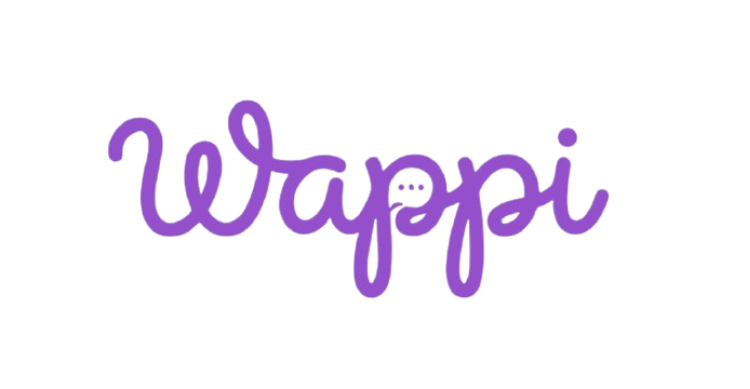

<div align="center">



<h1>Wappi</h1>

<h3>Automação inteligente para WhatsApp.</h3>

<p>
Crie robôs, automatize atendimentos, conecte integrações e deixe sua operação trabalhar de forma inteligente.
</p>

<br />

<a href="#">
  
</a>
<a href="#">
  
</a>
<a href="#">
  
</a>
<a href="#">
  
</a>

<br />

<a href="#">
  
</a>
<a href="#">
  
</a>
<a href="#">
  
</a>
<a href="#">
  
</a>

<br /><br />

<a href="#sobre-o-projeto">Sobre</a>
  •   <a href="#tecnologias">Tecnologias</a>
  •   <a href="#recursos">Recursos</a>
  •   <a href="#estrutura">Estrutura</a>

</div>

---

<div align="center">

## ⚡ Atendimento que não para.

</div>

O **Wappi** é uma plataforma de automação para WhatsApp desenvolvida para empresas que querem transformar seus atendimentos em uma operação mais rápida, organizada e inteligente.

A ideia é simples:

> **Você configura o robô. O Wappi cuida do resto.**

O sistema combina **automação**, **inteligência artificial**, **WhatsApp**, **arquivos**, **integrações externas** e **monitoramento de conversas** em uma única plataforma.

---

<div align="center">

## 🧠 O que é o Wappi?

<table>
<tr>
<td align="center" width="25%">

### 🤖

**Robôs**

Crie e configure seus próprios robôs de atendimento.

</td>

<td align="center" width="25%">

### ⚡

**Automação**

Automatize respostas e processos repetitivos.

</td>

<td align="center" width="25%">

### 🧠

**IA**

Use modelos de inteligência artificial para tornar os atendimentos mais inteligentes.

</td>

<td align="center" width="25%">

### 📊

**Monitoramento**

Acompanhe as conversas e o funcionamento dos seus robôs.

</td>
</tr>
</table>

</div>

---

## ✨ Recursos

<table>
<tr>
<td width="50%">

### 🤖 Robôs personalizados

Crie múltiplos robôs e configure cada um de acordo com a necessidade da sua empresa.

</td>

<td width="50%">

### 🧠 Treinamento

Defina instruções e informações para que cada robô conheça o contexto do negócio.

</td>
</tr>

<tr>
<td>

### 📁 Arquivos

Utilize arquivos como fonte de conhecimento para seus robôs.

</td>

<td>

### 🔌 Integrações

Conecte APIs e serviços externos para ampliar as capacidades das automações.

</td>
</tr>

<tr>
<td>

### 💬 WhatsApp

Conecte números do WhatsApp através da infraestrutura da Evolution API.

</td>

<td>

### 📈 Conversas

Acompanhe os atendimentos realizados pelos seus robôs.

</td>
</tr>
</table>

---

<div align="center">

## 🛠️ Tecnologias

<br />


<br /><br />


</div>

---

## 🏗️ Estrutura

```text
api/
│
├── app/
│   │
│   ├── core/
│   │   ├── config.py
│   │   ├── security.py
│   │   └── dependencies.py
│   │
│   ├── services/
│   │   ├── supabase.py
│   │   ├── gemini.py
│   │   ├── groq.py
│   │   ├── evolution.py
│   │   └── mercadopago.py
│   │
│   ├── routers/
│   │   ├── auth.py
│   │   ├── bots.py
│   │   ├── training.py
│   │   ├── files.py
│   │   ├── integrations.py
│   │   ├── whatsapp.py
│   │   ├── conversations.py
│   │   ├── subscriptions.py
│   │   └── webhooks.py
│   │
│   ├── schemas/
│   │   ├── auth.py
│   │   ├── bots.py
│   │   ├── training.py
│   │   ├── files.py
│   │   ├── whatsapp.py
│   │   └── subscriptions.py
│   │
│   └── utils/
│       ├── ai.py
│       ├── media.py
│       └── dates.py
│
├── .env
├── .env.example
├── .gitignore
├── requirements.txt
└── README.md
```

---

<div align="center">

## 🔥 Construído para automação

<table>
<tr>
<td align="center">

🟢 <b>WhatsApp</b>

</td>
<td align="center">

🟡 <b>Automação</b>

</td>
<td align="center">

🔵 <b>Integrações</b>

</td>
<td align="center">

🟣 <b>Inteligência Artificial</b>

</td>
<td align="center">

🔴 <b>Monitoramento</b>

</td>
</tr>
</table>

</div>

---

## 🚀 Desenvolvimento

O Wappi está atualmente em desenvolvimento.

A API é construída utilizando **FastAPI**, com uma arquitetura modular para manter autenticação, inteligência artificial, WhatsApp, pagamentos e demais integrações separados.

O objetivo é manter o projeto simples de evoluir, permitindo adicionar novas integrações e recursos sem transformar o backend em uma aplicação monolítica difícil de manter.

---

<div align="center">

## 💜 Wappi

**Automatize. Conecte. Atenda.**

<br />


<br /><br />

<sub>Wappi © 2026 — Todos os direitos reservados.</sub>

</div>
